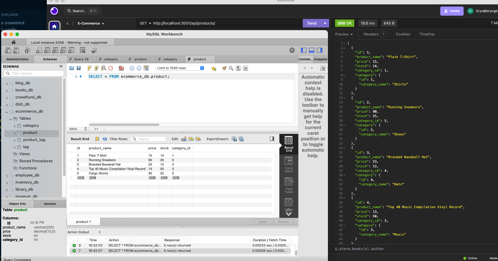

# Ecommerce

## Table of Contents

- [Description](#description)
- [User-Story](#user-story)
- [Questions](#questions)
- [Links](#links)
- [Images](#images)

## Description

A back end for an e-commerce site.

## User-Story

AS A manager at an internet retail company
I WANT a back end for my e-commerce website that uses the latest technologies
SO THAT my company can compete with other e-commerce companies

## Questions

For additional questions, contact [bryncidently](https://github.com/bryncidently) or email email@brynglotfelty.com.

## Links

Link to video [HERE](https://drive.google.com/file/d/1E04aM_oBdtl4TE5d4roBwWRMBbQ0sZxd/view?usp=sharing)

## Images

